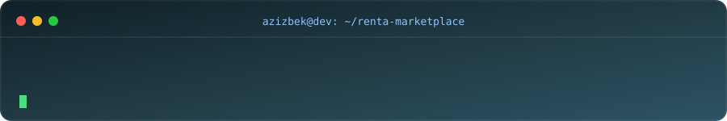

<picture>
  <source media="(prefers-color-scheme: dark)" srcset="https://capsule-render.vercel.app/api?type=waving&color=0:0f2027,50:2c5364,100:00c6ff&height=280&section=header&animation=fadeIn">
  <source media="(prefers-color-scheme: light)" srcset="https://capsule-render.vercel.app/api?type=waving&color=0:6a11cb,50:2575fc,100:00c6ff&height=280&section=header&animation=fadeIn">
  
</picture>

 

  

 

## 👋 Обо мне

<table>
<tr>
<td width="65%" valign="top">

Привет! Меня зовут **Азизбек Забиев** — full stack разработчик.
Работаю как с бэкендом, так и с фронтендом: от баз данных и серверной логики до интерфейсов, с которыми взаимодействует пользователь.

- 🔭 Разрабатываю сервисы на **Python, TypeScript/JavaScript, PostgreSQL, NestJS, Next.js**
- 🚀 Довожу продукты от идеи до готового рабочего сервиса — от Telegram Mini Apps до полноценных веб-платформ и мобильных приложений
- 🧩 Работаю по схеме **сайт + Telegram бот/Mini App на одной базе данных** — так продукт доступен пользователю в двух привычных точках входа
- 🌱 Постоянно изучаю новые технологии и подходы
- ⚡ Работаю с реальными продакшн-проектами: сервисы такси, платформа аренды недвижимости, AI-открытки, системы защиты и заказов
- 💬 Пишите смело — всегда открыт к общению и новым проектам

</td>
<td width="35%" align="center">

</td>
</tr>
</table>

 

 

## 🛠️ Технологии

**Языки**

**Frontend**

**Backend**

**Базы данных и инфраструктура**

**Инструменты**

 

 

## 🚀 Чем занимаюсь сейчас

<table>
<tr>
<td width="70%" valign="middle">

- 🏗️ Строю несколько продакшн-сервисов одновременно — от сервисов такси до платформы аренды недвижимости и AI-открыток
- 📱 Активно разрабатываю на стеке **Telegram Mini App + веб-сайт + бот**, где все части делят одну базу данных
- 🧩 Перехожу от MVP к масштабированию: тестирую продукты через Mini App перед запуском полноценных мобильных приложений
- 🏠 Прямо сейчас в фокусе — **RenTa**: довожу маркетплейс аренды недвижимости до идеала

</td>
<td width="30%" align="center" valign="middle">

</td>
</tr>
</table>

 

## 💼 Фриланс

 

## ✨ GitHub Metrics

<picture>
  <source media="(prefers-color-scheme: dark)" srcset="https://github-readme-stats.vercel.app/api?username=zabikazimovich-hash&show_icons=true&theme=react&hide_border=true&bg_color=00000000&title_color=00c6ff&icon_color=8CC5FF&text_color=c9d1d9">
  <source media="(prefers-color-scheme: light)" srcset="https://github-readme-stats.vercel.app/api?username=zabikazimovich-hash&show_icons=true&theme=default&hide_border=true">
  
</picture>
<picture>
  <source media="(prefers-color-scheme: dark)" srcset="https://github-readme-stats.vercel.app/api/top-langs/?username=zabikazimovich-hash&layout=compact&theme=react&hide_border=true&bg_color=00000000&title_color=00c6ff&text_color=c9d1d9">
  <source media="(prefers-color-scheme: light)" srcset="https://github-readme-stats.vercel.app/api/top-langs/?username=zabikazimovich-hash&layout=compact&theme=default&hide_border=true">
  
</picture>

 

<picture>
  <source media="(prefers-color-scheme: dark)" srcset="https://streak-stats.demolab.com?user=zabikazimovich-hash&theme=react&hide_border=true&background=00000000&ring=00c6ff&fire=00c6ff&currStreakLabel=00c6ff">
  <source media="(prefers-color-scheme: light)" srcset="https://streak-stats.demolab.com?user=zabikazimovich-hash&theme=default&hide_border=true">
  
</picture>

 

## 📈 График активности

<picture>
  <source media="(prefers-color-scheme: dark)" srcset="https://github-readme-activity-graph.vercel.app/graph?username=zabikazimovich-hash&theme=react-dark&hide_border=true&bg_color=00000000">
  <source media="(prefers-color-scheme: light)" srcset="https://github-readme-activity-graph.vercel.app/graph?username=zabikazimovich-hash&theme=minimal&hide_border=true&bg_color=ffffff00">
  
</picture>

 

## 🐍 Активность (змейка)

 

## 📌 Проекты

<table>
<tr>
<td width="33%" valign="top">

**🚕 TTT‑Taxi**

Приложения для водителей и пассажиров с real-time трекингом поездки на карте.

</td>
<td width="33%" valign="top">

**🚖 TaxiApp**

Веб-версия сервиса такси — заказ поездки прямо из браузера без установки приложения.

</td>
<td width="33%" valign="top">

**🏠 RenTa**

Маркетплейс аренды недвижимости: каталог, бронирования, CRM и Telegram-бот на одной базе.

</td>
</tr>
<tr>
<td width="33%" valign="top">

**🎉 Tabriklayman**

AI-платформа открыток: сайт, Telegram Mini App и бизнес-панель на одной базе данных.

</td>
<td width="33%" valign="top">

**🛡️ Protection**

Сервис онлайн-защиты с авторизацией и защищёнными маршрутами, панель администратора.

</td>
<td width="33%" valign="top">

**🛍️ Ordery**

Лёгкое веб-приложение для оформления заказов — быстрый интерфейс без лишних зависимостей.

</td>
</tr>
<tr>
<td width="33%" valign="top">

**💼 Portfolio**

Личный сайт-визитка со всеми проектами и контактами, деплой на Heroku.

</td>
<td width="33%" valign="top">

**📊 RenTa Analytics**

Дашборд метрик по объектам и сделкам — следующий шаг развития RenTa.

</td>
<td width="33%" valign="top">

**🤝 Tabriklayman Mobile**

Мобильное приложение-компаньон для платформы открыток на React Native.

</td>
</tr>
</table>

 

## 🌐 Соцсети и контакты

&nbsp;

&nbsp;

&nbsp;

 

 

<picture>
  <source media="(prefers-color-scheme: dark)" srcset="https://capsule-render.vercel.app/api?type=waving&color=0:0f2027,50:2c5364,100:00c6ff&height=100&section=footer">
  <source media="(prefers-color-scheme: light)" srcset="https://capsule-render.vercel.app/api?type=waving&color=0:6a11cb,50:2575fc,100:00c6ff&height=100&section=footer">
  
</picture>

